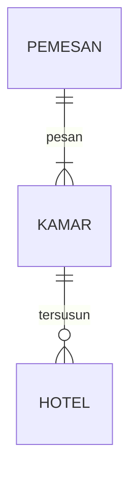

## 1.1 Latar Belakang

Website penyedia jasa travel adalah platform online yang memungkinkan individu atau grup untuk mencari, memesan, dan mengatur perjalanan mereka. Konsep ini telah berkembang pesat seiring dengan pertumbuhan internet dan teknologi. Berikut adalah beberapa poin penting dalam latar belakangnya:

1. Perkembangan Teknologi: Kemajuan teknologi, terutama internet, telah memungkinkan perusahaan travel untuk memanfaatkan platform online sebagai alat utama untuk berinteraksi dengan pelanggan. Ini mempermudah reservasi tiket, akomodasi, dan aktivitas wisata.

## 1.2. Deksripsi Teknologi Informasi

Website penyedia jasa travel telah menjadi bagian integral dari industri pariwisata modern. Mereka memungkinkan pelanggan untuk mencari, membandingkan, dan memesan tiket pesawat,
hotel, paket liburan, penyewaan mobil, dan berbagai layanan perjalanan lainnya secara online.

## 1.3. Branding

Pada tahap ini kita mengeksplorasikan branding dari sistem yang dibuat.Branding meliputi

Merk:TravelPedia

Tagline:Kenyamanan BErlibur Anda Adalah Tugas Kami

Campaign:Menyediakan website yang memudahkan user untuk berlibur/rekreasi keluarga kemana saja

TARGET USER:

USIA 15+

Seseorang yang ingin berlibur

Seseorang yang ingin memesan tiket perjalanan

Seseoranag yang ingin memesan tiket hotel

Seseorang yang senang dengan jalan jalan

USER EXPERIENCE THEME:

Minimalis

Menarik

Simple

## 2. User Story

Sebagai | Saya ingin bisa| Sehingga |Prioritas
---|---|---|---
Pengguna | Memesan Destinasi | Bisa memesan destinasi yang diinginkan| ⭐⭐⭐⭐⭐
Pengguna | Memesan Tiket | Bisa memesan berbagai tiket| ⭐⭐⭐⭐⭐
Pengguna | Membuat Akun Aplikasi | Bisa mengetahui pilihan pemesanan| ⭐⭐⭐⭐⭐
Pengguna | Melihat Foto Destinasi | Bisa mengetahui destinasi yang dituju| ⭐⭐⭐⭐⭐

## 3. Struktur Data

Cara membuat aneka macam bentuk grafik menggunakan mermaid.js bisa lihat di [https://mermaid.js.org/syntax/entityRelationshipDiagram.html](https://mermaid.js.org/syntax/entityRelationshipDiagram.html) 

## 4. Arsitektur Sistem

Masih pake mermaid.js juga bisa lihat flowchart di [https://mermaid.js.org/syntax/flowchart.html](https://mermaid.js.org/syntax/flowchart.html)

## 5. Teknologi, Library, dan Framework

bla bla bla

## 6. Desain User Experience dan User Interface

## 7. Demonstrasi Video

Link youtube nya

## 8. Bagaimana mesin komputasi dan sistem operasi berperan dalam produk teknologi informasimu ?

Link youtube nya di detik jawaban ini

## 9. Bagaimana algoritma, struktur data, dan bahasa pemrograman berperan dalam produk teknologi informasimu ?

Link youtube nya di detik jawaban ini

## 10. Bagaimana metode pengembangan perangkat lunak / Software Development Life Cycle berperan dalam produk teknologi informasimu ?

Link youtube nya di detik jawaban ini

## 11. Bagaimana database / sistem basis data berperan dalam produk teknologi informasimu ?

Link youtube nya di detik jawaban ini
